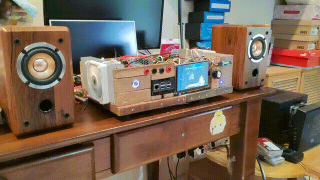

# 🎵 Pi Music Console (Pure Web Edition)

A premium touchscreen music player for **Raspberry Pi 5** featuring a modern Web UI, PCM5122 DAC support, and auto-boot kiosk mode powered by Wayland/Weston.

---

## 🏗️ System Architecture

The original design targets a **pure‑web UI** running on Wayland/Weston with Chromium in kiosk mode, removing X11/Kivy for greater stability on the Raspberry Pi 5. The boot flow is illustrated below:

```mermaid
graph TD
    A[Power ON] --> B[Debian 13 (Trixie) boots]
    B --> C[Auto‑login on tty1]
    C --> D[startup.sh via .bash_profile]
    D --> E[Weston (Wayland) starts]
    E --> F[Flask API backend starts]
    F --> G[Chromium kiosk launches]
    G --> H[Web UI on attached display]
```

> **Note:** If your CSI screen isn’t optimal, you can use any HDMI/DSI monitor. The architecture is display‑agnostic; only the final node changes. Feel free to adjust the diagram or description to match your hardware.

---
---

## ⚡ Quick Start

### 1. Installation
Run the installer on your Pi to set up dependencies and the boot environment.
```bash
git clone https://github.com/kiinging/Pi_Music_Console.git
cd Pi_Music_Console
bash install.sh
```

### 2. Add Music
Copy your media files to `~/Music` or `~/Videos`.
```bash
mkdir -p ~/Music ~/Videos
# Transfer files...
```
## 📽️ Demo Video


*Click the link below to view the full‑resolution video:*

[▶️ Full demo (MP4)](https://raw.githubusercontent.com/kiinging/Pi_Music_Console/main/assets/demo.mp4)

### 3. Startup
The system is designed to start automatically on boot. To start manually:
```bash
bash scripts/startup.sh
```

---

## 📦 Hardware Requirements
- **Raspberry Pi 5**
- **5-inch CSI/DSI/HDMI Touchscreen** (800x480)
- **PCM5122 HiFi DAC** (e.g., HiFiBerry DAC+)
- **ALPS RK27** rotary knob for volume control (GPIO as required)
- **JlH1969 Class A Amplifier** (≈25 VDC bias, 1.4 A)
- **INA219** sensor measuring bias voltage & current
- **Two 12 V PC fans** for heatsink cooling

---

## 🖥️ Software Stack
- **OS:** Debian GNU/Linux 13 (trixie)
- **Display Server:** Weston (Wayland)
- **Browser:** Chromium (Ozone/Wayland)
- **Backend:** Python 3 + Flask + MPV
- **Frontend:** Vanilla HTML5 / CSS3 / JS

---

## 🔧 Configuration

### Audio (PCM5122)
Ensure `/boot/firmware/config.txt` has:
```ini
dtoverlay=hifiberry-dacplus
```

### Boot Sequence
The system uses `agetty` for auto-login on `tty1`, which then triggers `scripts/startup.sh` via `~/.bash_profile`.

---

## 🐛 Troubleshooting
- **Black Screen:** Check `/tmp/weston.log`. Ensure no Xorg session is running.
- **No Sound:** Run `aplay -l` to verify the DAC is detected as Card 0 or 1.
- **Touch Issues:** Weston handles touch natively; ensure your screen is supported by the kernel.

---
*Built for Curtin Electronic Fundamentals 2026.*
Music can be download from: *https://monochrome.tf/*