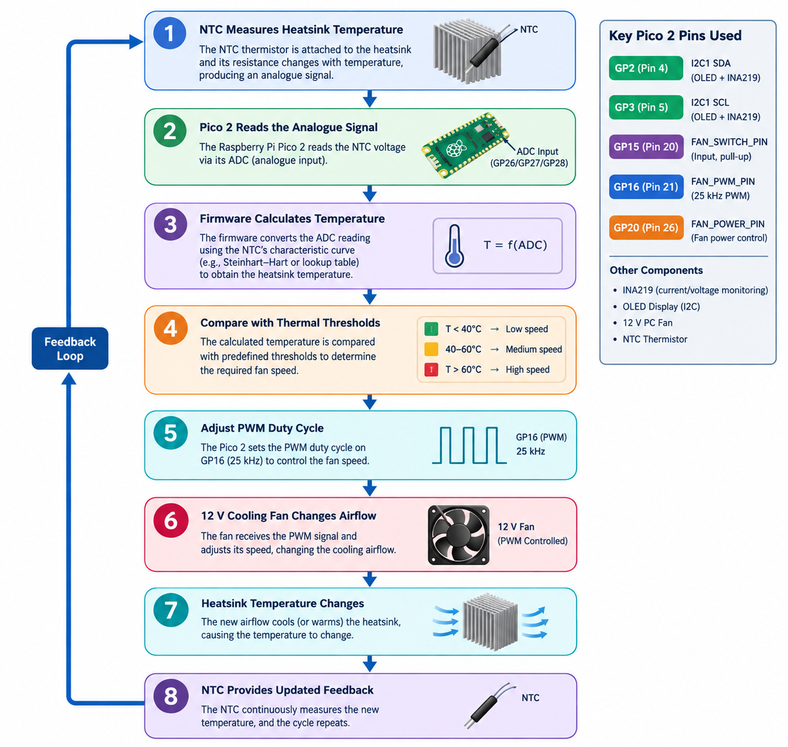
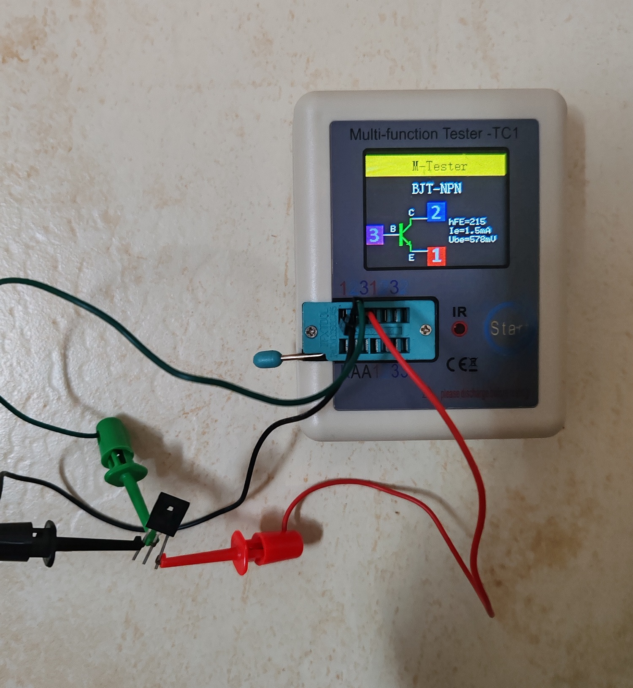
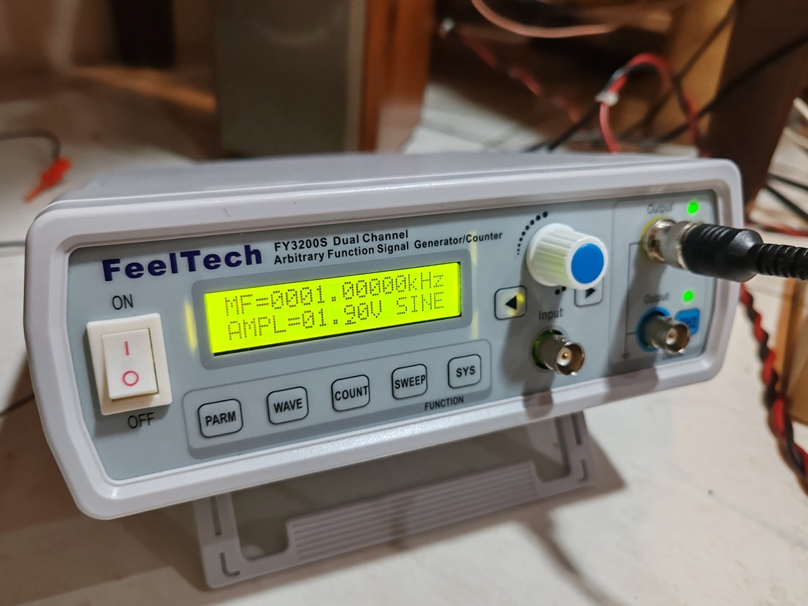
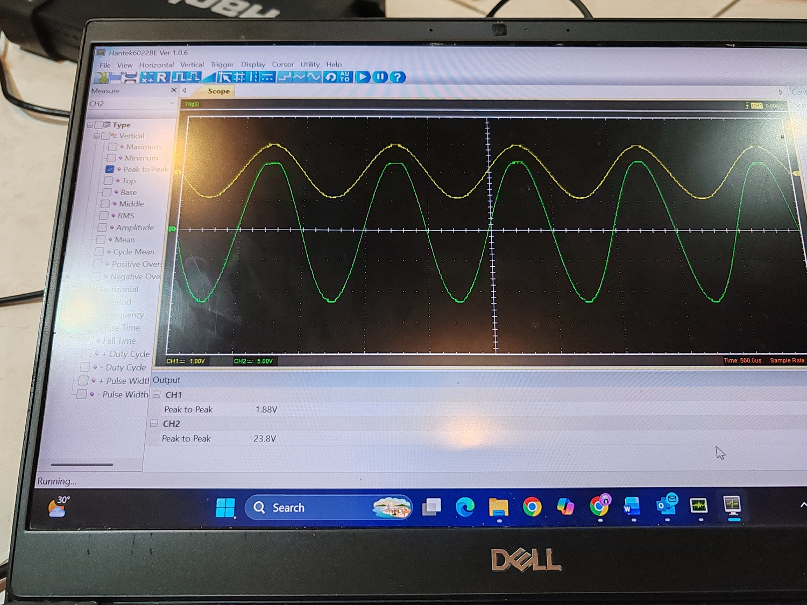

# SmartClass-A: An Integrated Smart Audio Platform with IoT Monitoring and Intelligent Thermal Control

# Table of Contents
- [Executive Summary](#executive-summary)
- [Background / Motivation](#background--motivation)
- [Development / Implementation](#development--implementation)
  - [Music Streamer](#music-streamer)
  - [Control Board](#control-board)
  - [Power Amplifier](#power-amplifier)
- [Result](#result)
- [Components](#components)

## Executive Summary
The main difference from commercial music streamers is that we use a Raspberry Pi 5 as the core of our design. A large SSD can store hundreds of songs. Commercial streamers typically stream music online, whereas we support both online streaming and local playback. Many people still prefer to keep their favorite music on a physical medium like a CD; with our solution they can store the same collection on an SSD. 

In addition, we integrate a Class A amplifier with the music streamer. Class A amplifiers are renowned among audiophiles for their sound quality, but they are also known for high power dissipation even when no audio is being output. This heat must be transferred to a heatsink, and excessive temperature can cause thermal runaway of the power transistors. We implemented active cooling using a Raspberry Pi Pico with PID feedback control. An NTC thermistor measures the heatsink temperature; the Pico processes this data and drives a 12 V DC fan via PWM.

A 2.42‑inch OLED display shows the bias voltage and current, which is primarily a cosmetic feature (about 90 % of the display’s purpose). It informs the listener that the music streamer is operating stably. The bias voltage and current is measured with an INA219 current‑sensor IC.

## Background / Motivation
High-fidelity audio has developed into a specialised industry in which amplifier topology, analogue circuit design, digital audio processing, thermal management and overall product engineering all contribute to the listening experience. Premium audio manufacturers such as Accuphase, Pass Labs and Naim have demonstrated different approaches to high-end audio, ranging from dedicated Class A amplification to integrated digital and network audio systems. These products demonstrate the continuing demand for high-quality audio equipment that combines sophisticated engineering with a strong product identity.

Class A amplification is particularly interesting for this project because the output devices are biased to operate continuously, resulting in low crossover distortion and characteristics that have made Class A designs popular among high-fidelity audio enthusiasts. However, this operating principle also creates a significant engineering challenge: the amplifier dissipates substantial heat even when it is producing little or no audio output. The resulting heatsink temperature must therefore be monitored and controlled to maintain stable operation and protect the amplifier's power devices.

At the same time, the way people access music has changed significantly. Modern audio systems increasingly combine local digital music libraries with network connectivity and online streaming. A single device can now provide music storage, playback, digital-to-analogue conversion, network access and user control. However, high-end systems that combine these functions with premium analogue amplification can represent a substantial investment, while many products are developed as proprietary commercial platforms.

This project was motivated by the opportunity to explore an alternative approach: **combining high-fidelity analogue amplification with accessible embedded and IoT technologies to develop a locally engineered audio platform**. Rather than treating the amplifier, music streamer and thermal-control system as separate devices, the project integrates them into a single platform centred around a Raspberry Pi 5.

The Raspberry Pi 5 provides the computing platform for music playback, local music-library management, network connectivity and user interaction. A large SSD provides local storage for an extensive music collection, while a dedicated DAC provides the interface between the digital music system and the analogue Class A amplifier. This creates a system that can combine the ownership and convenience of a local digital music library with modern network-based music playback.

The project also addresses the thermal-management challenge of Class A amplification through automation. An NTC thermistor measures the amplifier heatsink temperature, while a Raspberry Pi Pico processes the temperature feedback and controls a 12 V DC cooling fan through PWM. The system therefore demonstrates how embedded control technology can be applied to a traditionally analogue high-fidelity product. An INA219 current-sensor IC is additionally used to monitor amplifier bias voltage and current, with the information presented through a 2.42-inch OLED operating-status display.

The broader motivation is to investigate whether these technologies can form the basis of a **Sarawak-developed audio product**. The project combines local engineering development with embedded computing, digital audio, IoT connectivity, instrumentation and automatic control. The current work represents a prototype and technology platform rather than a finished commercial product, providing a foundation for subsequent development in areas such as acoustic and electrical performance optimisation, industrial design, reliability testing, manufacturing, user experience and commercialisation.

## Development / Implementation
The design is split into three parts: music streamer, control board and power amplifier.
  - [Music streamer](#music streamer)

### Music Streamer
The music streamer is designed as an embedded, network-enabled audio control platform built around the Raspberry Pi 5. The system integrates local digital music management, high-quality audio playback, touchscreen-based user interaction, and hardware control within a single compact platform. Its software architecture was developed using Python and Flask, with MPV serving as the audio playback engine and SQLite providing persistent storage for media metadata and system settings.

The overall design follows a modular architecture consisting of five main functional layers: **media management, playback control, user interface, system control, and hardware integration**.

#### 1. Media Management and Library Organisation

The music library is organised locally on the Raspberry Pi using dedicated music and video directories. The software automatically scans these directories and maintains a SQLite database containing information such as track title, artist, album, track number, disc number, duration, audio format, sample rate, bit depth, and bitrate.

Audio metadata is obtained using the Mutagen library, while FFprobe is used to obtain technical audio information. A background scanning process performs metadata analysis after system startup rather than delaying the user interface during boot. The scanning process is deliberately throttled to reduce CPU and storage loading on the Raspberry Pi.

The database-based approach also provides persistent storage for album information, user-defined categories, ratings, and system settings. The software includes database-repair functions to detect missing media, correct media types, and maintain consistency between the physical music library and the database.

This design allows the system to manage a growing local music collection without requiring a separate cloud music service.

#### 2. Audio Playback Architecture

MPV is used as the core playback engine because it provides efficient hardware-accelerated media playback and can operate reliably on the Raspberry Pi 5. Rather than directly controlling MPV through a graphical application, the Python control layer communicates with MPV through a local Unix-domain IPC socket.

This provides a lightweight separation between the user interface and the actual audio playback process. Playback commands such as play, pause, resume, stop, and seek are transmitted through the IPC interface, while playback status such as elapsed time, duration, current file, and pause state can be retrieved from the player.

The system also batches multiple MPV property requests into a single IPC connection. This reduces communication overhead and allows the touchscreen interface to obtain playback information smoothly without repeatedly creating separate connections.

The playback engine is configured for the Raspberry Pi 5 environment with Wayland support, GPU-based video output, automatic safe hardware decoding, and suppression of unnecessary graphical elements. This enables the same platform to support both music playback and optional video playback.

#### 3. Digital Audio Output Selection

The system provides selectable audio output paths. The primary output is the integrated PCM5122-based high-quality audio interface, while an external USB DAC can also be selected.

The software automatically selects the appropriate ALSA audio device according to the user's selected output. It also detects the corresponding hardware mixer control so that the volume control operates on the currently selected audio device.

The audio-output selection is stored persistently in the SQLite system settings database. Consequently, the selected DAC configuration and volume level can be restored after system restart.

This architecture provides flexibility for future hardware upgrades without requiring major changes to the application software.

#### 4. Touchscreen and Web-Based User Interface

The user interface is implemented using Flask and HTML templates and is designed for operation on the Raspberry Pi's touchscreen display. The Flask application provides REST-style API endpoints for interaction with the playback engine and hardware functions.

The interface provides access to:

* music and album browsing;
* track metadata and album artwork;
* play, pause, stop and seek functions;
* playback progress and duration;
* volume control;
* audio-output selection;
* three-band equalisation;
* video playback control;
* cooling-fan control;
* display power control; and
* system shutdown.

Album artwork is automatically searched from the relevant music directory, allowing the user interface to present album-level visual information without requiring an external online service.

The architecture also separates the desktop interface from the touchscreen interface, allowing the same embedded platform to provide different user-interface layouts according to the operating environment.

#### 5. Audio Processing and Equalisation

A software-based three-band equaliser is incorporated into the playback system. The equaliser provides independent adjustment of bass, midrange and treble frequencies.

The processing is implemented through MPV's audio-filter mechanism, with centre frequencies of approximately 80 Hz, 1 kHz and 9 kHz. When all equaliser settings are returned to zero, the additional audio processing is removed from the playback chain.

This approach allows basic tonal adjustment to be performed digitally while maintaining a simple signal-processing architecture.

#### 6. Hardware Control and Thermal Management

The Raspberry Pi 5 also acts as the system controller for auxiliary hardware functions. A GPIO output is used to control the cooling fan associated with the audio amplifier system.

The software provides an API-based fan-control function that can switch the GPIO output between ON and OFF states. The fan is explicitly initialised to the OFF state during system startup to establish a known hardware condition.

This software-controlled approach provides a foundation for integrating amplifier thermal management with the music-streaming platform. In the complete system, the cooling subsystem can therefore operate as part of the overall audio-system control architecture rather than as an independent device.

The software also provides control of the touchscreen backlight and controlled system shutdown, allowing the Raspberry Pi to function as an integrated appliance rather than a conventional general-purpose computer.

#### 7. System State and Reliability

Important operating parameters, including volume and selected audio output, are stored persistently in the local database. This ensures that the system can recover its previous operating configuration after restarting.

Several fault-handling mechanisms are incorporated into the software. These include detection of missing media files, database consistency repair, validation of requested media paths, MPV process monitoring, automatic cleanup of stale IPC sockets, and fallback handling for unavailable mixer controls.

The system also avoids unnecessary background processing during normal operation. For example, media metadata scanning is performed in a separate background thread and status polling requests are filtered from the application log to reduce unnecessary system overhead.

#### 8. Overall System Architecture

The resulting architecture can be viewed as a layered embedded audio platform:

**Touchscreen/Web UI → Flask Application → SQLite + System Services → MPV Playback Engine → ALSA → PCM5122 DAC → Analog Audio System**

In parallel, the Flask control layer provides hardware interfaces:

**Flask Application → Raspberry Pi GPIO → Cooling Fan**

and

**Flask Application → Display Backlight Control → Touchscreen**

This architecture combines digital media management, audio playback, user interaction and hardware control within one Raspberry Pi 5 platform. The modular design also allows individual components, such as the DAC, amplifier, cooling system or user interface, to be upgraded without redesigning the complete software architecture.

### Control Board
The amplifier is supported by a dedicated microcontroller-based monitoring and thermal-control board built around the Raspberry Pi Pico 2. The board integrates electrical measurement, temperature monitoring, local status indication, manual fan control and automatic variable-speed cooling into a single embedded control subsystem.

The design is intended specifically for the JLH1969 Class-A power amplifier, where continuous amplifier bias results in significant heat dissipation even when the audio output power is relatively low. Consequently, thermal management is treated as an integral part of the amplifier system rather than as an independent cooling accessory.

The Pico 2 executes the monitoring and control functions using FreeRTOS, providing separate tasks for measurement acquisition, display updating, fan control and switch monitoring.

### 1. Pico 2 Hardware Interface

The Raspberry Pi Pico 2 provides the central control interface between the amplifier monitoring sensors, OLED display, fan-control circuit and user-operated fan switch.

The principal pin allocation is shown below.

| Physical Pin | GPIO / Function | Usage / Connection           | Physical Pin | GPIO / Function | Usage / Connection        |
| -----------: | --------------- | ---------------------------- | -----------: | --------------- | ------------------------- |
|            1 | GP0             | —                            |           40 | VBUS            | USB 5 V                   |
|            2 | GP1             | —                            |           39 | VSYS            | System input              |
|            3 | GND             | Ground                       |           38 | GND             | Ground                    |
|            4 | **GP2**         | **I²C1 SDA – OLED / INA219** |           37 | 3V3_EN          | —                         |
|            5 | **GP3**         | **I²C1 SCL – OLED / INA219** |           36 | 3V3(OUT)        | 3.3 V supply              |
|            6 | GP4             | —                            |           35 | ADC_VREF        | —                         |
|            7 | GP5             | —                            |           34 | **GP28 / ADC2** | **NTC temperature input** |
|            8 | GND             | Ground                       |           33 | GND             | Ground                    |
|            9 | GP6             | —                            |           32 | GP27 / ADC1     | —                         |
|           10 | GP7             | —                            |           31 | GP26 / ADC0     | —                         |
|           11 | GP8             | —                            |           30 | RUN             | Reset                     |
|           12 | GP9             | —                            |           29 | GP22            | —                         |
|           13 | GND             | Ground                       |           28 | GND             | Ground                    |
|           14 | GP10            | —                            |           27 | GP21            | —                         |
|           15 | GP11            | —                            |           26 | **GP20**        | **Fan power control**     |
|           16 | GP12            | —                            |           25 | GP19            | —                         |
|           17 | GP13            | —                            |           24 | GP18            | —                         |
|           18 | GND             | Ground                       |           23 | GND             | Ground                    |
|           19 | GP14            | —                            |           22 | GP17            | —                         |
|           20 | **GP15**        | **Fan switch input**         |           21 | **GP16**        | **Fan PWM control**       |

The principal control-board interfaces are therefore:

* **GP2 / Physical Pin 4:** I²C data bus shared by the OLED and INA219 sensors.
* **GP3 / Physical Pin 5:** I²C clock bus shared by the OLED and INA219 sensors.
* **GP28 / Physical Pin 34:** analogue input for the NTC thermistor temperature measurement.
* **GP15 / Physical Pin 20:** digital input for the local fan-enable switch.
* **GP16 / Physical Pin 21:** 25 kHz PWM output for variable-speed fan control.
* **GP20 / Physical Pin 26:** digital fan-power enable output.

This pin allocation leaves additional GPIO and ADC resources available for future expansion, such as additional temperature sensors, alarm indicators or amplifier protection signals.

### 2. Dual-Channel Electrical Monitoring

Two INA219 current/voltage monitoring devices are incorporated into the control board. The sensors use I²C communication and are assigned different I²C addresses, allowing both amplifier channels to share the same two-wire communication bus.

The current monitoring arrangement is:

**INA219 @ 0x40 → Left amplifier channel**

**INA219 @ 0x41 → Right amplifier channel**

Each INA219 measures the corresponding amplifier-channel current through a 0.1 Ω shunt resistor. The Pico 2 periodically acquires the measurements and converts the sensor readings into engineering units.

The control software calculates the electrical power using:

**P = V × I**

The monitoring subsystem therefore provides real-time information on:

* amplifier supply voltage;
* left-channel current;
* right-channel current;
* left-channel power consumption;
* right-channel power consumption; and
* total amplifier electrical power.

This measurement is particularly useful for the JLH1969 because its Class-A operating mode produces relatively high and continuous quiescent power dissipation. The monitoring system therefore provides an objective indication of the electrical loading of the amplifier.

### 3. Shared I²C Monitoring and Display Bus

The OLED display and both INA219 devices are connected to the same I²C1 interface.

**Pico 2 GP2 → SDA → OLED + INA219 Left + INA219 Right**

**Pico 2 GP3 → SCL → OLED + INA219 Left + INA219 Right**

The use of a shared I²C bus reduces the number of GPIO connections required and simplifies the control-board wiring. The INA219 devices are distinguished by their different I²C addresses, while the OLED uses its own I²C address.

The I²C interface is configured for 400 kHz operation for responsive local display updates and sensor communication.

### 4. NTC Temperature Measurement

An NTC thermistor is incorporated into the thermal-control system to measure the temperature of the amplifier heatsink.

The thermistor is connected to the Pico 2 through **GP28 / ADC2 (Physical Pin 34)**. The NTC forms a voltage-divider circuit, allowing the Pico 2's analogue-to-digital converter to measure a voltage related to the heatsink temperature.

The firmware converts the ADC measurement into temperature and uses this information as the feedback variable for the cooling controller.

The thermal-control architecture is therefore:

**JLH1969 heatsink → NTC thermistor → Pico 2 ADC → temperature calculation → fan PWM control**

The sensor is positioned close to the amplifier's main heat-generating region so that the control system responds to the actual thermal condition of the amplifier rather than simply measuring ambient temperature.

### 5. Intelligent Fan-Speed Control

A 12 V PC cooling fan is used to provide forced-air cooling for the amplifier heatsink.

The fan interface consists of two separate control signals:

**GP16 / Physical Pin 21 → PWM speed control**

**GP20 / Physical Pin 26 → fan power enable**

The PWM output operates at approximately **25 kHz**, corresponding to the standard PWM control frequency commonly used by four-wire PC fans.

The PWM duty cycle determines the fan operating speed. This allows the controller to provide only the amount of airflow required by the current thermal condition.

For example, the control strategy can progressively increase the fan duty cycle as the measured heatsink temperature rises:

| Heatsink Temperature         | Fan Control                     |
| ---------------------------- | ------------------------------- |
| Low temperature              | Fan OFF / minimum speed         |
| Normal operating temperature | Low-speed cooling               |
| Elevated temperature         | Medium-speed cooling            |
| High temperature             | High-speed cooling              |
| Protection threshold         | Maximum cooling / thermal alarm |

The exact temperature thresholds can be adjusted experimentally after characterising the thermal behaviour of the amplifier.

### 6. Manual Fan Enable

A local fan switch is connected to **GP15 / Physical Pin 20**.

The GPIO is configured with an internal pull-up resistor. The switch therefore uses an active-low arrangement:

**Switch open → GP15 HIGH → fan power disabled**

**Switch closed → GP15 LOW → fan power enabled**

This provides a simple physical control interface while retaining the possibility of automatic fan-speed regulation through the PWM channel.

The manual control also provides a convenient way to force the cooling system into an enabled state during amplifier testing, thermal characterisation or maintenance.

### 7. OLED Operating Display

A 128 × 32 pixel OLED display provides local monitoring of the amplifier operating condition.

The display receives measurement information through the shared I²C bus and presents key parameters such as amplifier current, supply voltage and total power consumption.

For example, the operating screen can present information in the form:

**L: 1.45 A   24.5 V**

**R: 1.44 A   70.6 W**

This allows the user to observe the electrical operating condition directly at the amplifier without opening the Raspberry Pi interface.

The OLED therefore serves as a **local engineering-status interface**, providing real-time operating information while also contributing to the integrated product interface.

### 8. FreeRTOS Control Architecture

The Pico 2 firmware uses FreeRTOS to separate the different control functions into independent tasks.

The principal software tasks are:

**INA219 Monitoring Task**
Periodically reads the two current-monitoring devices, calculates channel and total power, and publishes the latest measurement through a FreeRTOS queue.

**OLED Display Task**
Receives the latest measurement and updates the local display.

**Fan Control Task**
Generates the 25 kHz PWM signal and determines the fan duty cycle according to the required cooling level.

**Switch Monitoring Task**
Monitors the physical fan switch and controls the fan-power enable signal.

The measurement queue provides a controlled interface between the data-acquisition and display tasks. This prevents the display update process from blocking the sensor acquisition process.

The architecture also provides a straightforward pathway for integrating the NTC temperature controller into the existing firmware.

### 9. Closed-Loop Thermal Management

The completed thermal-management system operates as a closed-loop controller.

The control sequence is:

**Figure 1. Closed-loop Intelligent Thermal Control Sequence.**

The design avoids operating the cooling fan continuously at maximum speed. Instead, fan speed is matched to the thermal requirement of the amplifier, providing a balance between **thermal stability, energy consumption and acoustic noise**.

An upper temperature threshold can also be incorporated as a protection condition. When this threshold is reached, the controller can command maximum fan speed and provide a thermal warning.

### 10. Integrated System Architecture

The control board forms the real-time instrumentation and thermal-management layer of the complete audio system.

The overall architecture is:

**Raspberry Pi 5**

→ Music library management
→ Flask user interface
→ MPV playback
→ PCM5122 DAC
→ JLH1969 Class-A amplifier

**Raspberry Pi Pico 2**

→ INA219 Left Channel
→ INA219 Right Channel
→ NTC heatsink temperature sensor
→ OLED operating display
→ Fan switch
→ PWM fan control
→ 12 V cooling fan

The two embedded controllers therefore have clearly separated responsibilities. The Raspberry Pi 5 performs high-level digital audio and user-interface functions, while the Pico 2 performs deterministic real-time measurement and thermal-control functions.

This distributed architecture improves modularity and provides a dedicated control layer for the amplifier. It also creates a foundation for future expansion, including additional temperature sensors, thermal alarms, amplifier protection monitoring and remote monitoring through the Raspberry Pi 5.

### 11. Design Summary

The amplifier monitoring and thermal-control board combines **real-time electrical instrumentation, temperature feedback, digital control and local user feedback** in a compact microcontroller subsystem.

The integration of dual INA219 sensors provides continuous monitoring of the two amplifier channels, while the NTC thermistor provides direct thermal feedback from the heatsink. The Pico 2 processes these measurements using a FreeRTOS-based architecture and regulates a 12 V cooling fan through a 25 kHz PWM interface.

Consequently, the cooling system is not simply an auxiliary fan attached to the amplifier. It forms an intelligent closed-loop subsystem that actively monitors and responds to the operating condition of the Class-A amplifier.

Together with the Raspberry Pi 5 music streamer and PCM5122 DAC, the control board forms an integrated embedded audio platform combining **digital music streaming, high-quality audio conversion, real-time electrical monitoring, intelligent thermal management and local human-machine interaction**.

### Power Amplifier
## Power Amplifier

The power amplifier stage is based on the **John Linsley Hood (JLH) 1969 Class-A amplifier**, selected as the analogue power-amplification core of the SmartClass-A platform. The JLH 1969 topology is historically significant for its minimalist Class-A architecture, in which the output devices operate continuously rather than switching between conduction regions as in conventional Class-B or Class-AB output stages. This operating principle eliminates crossover distortion associated with output-stage switching and provides a highly linear operating regime, but at the cost of substantial continuous power dissipation. The original JLH design demonstrated approximately 10 W output capability with low harmonic distortion and a wide usable audio response, establishing the circuit as an influential high-fidelity transistor amplifier design.

For this project, the JLH 1969 circuit has been implemented as a **dual-mono stereo power amplifier**, with a dedicated 220 V / 20 V, 5 A EI transformer allocated to each amplifier channel. This arrangement provides an independent power source for the left and right channels and reduces the degree to which the instantaneous current demand of one channel is coupled into the supply of the other channel. The dual-transformer architecture is therefore consistent with the project's high-fidelity design objective and provides a clear separation between the two amplifier channels.

### 1. Dedicated Dual-Mono Power Supply

Each JLH1969 channel is supplied by its own **220 V / 20 V, 5 A EI transformer**. The transformers provide galvanic isolation from the mains and deliver a substantial low-voltage AC source suitable for the high continuous current requirement of the Class-A output stage.

The use of separate transformers for the two channels creates a dual-mono power architecture:

**Left channel:**
220 V AC → EI transformer → rectifier → CRC filter → JLH1969 left channel

**Right channel:**
220 V AC → EI transformer → rectifier → CRC filter → JLH1969 right channel

This architecture avoids sharing a single high-current transformer between both amplifier channels and provides independent reservoir capacity for each channel. It also makes the power-amplifier subsystem physically and electrically modular.

The use of a conventional EI transformer is deliberate. The transformer provides a robust linear-frequency power source with no high-frequency switching stage in the main amplifier supply. This is appropriate for a high-fidelity analogue amplifier where the power supply is treated as an important part of the overall analogue signal chain.

### 2. Discrete Ultrafast Bridge Rectifier

Instead of using an integrated bridge-rectifier package, each amplifier supply uses a **discrete bridge rectifier constructed from MUR820 power diodes in TO-220 packages**.

The MUR820 is an ultrafast 8 A, 200 V rectifier with a specified reverse-recovery time in the tens-of-nanoseconds range.

The discrete implementation provides several engineering advantages. Individual power diodes can be physically separated, mounted for improved thermal management and positioned to minimise the length of high-current wiring. The TO-220 construction also allows the rectifier devices to be mechanically coupled to an appropriate thermal path rather than concentrating all rectifier heat in a small integrated bridge package.

The selection of an ultrafast rectifier is also consistent with the objective of reducing reverse-recovery effects in the rectifier stage. However, the design does not rely on the diode speed alone to determine audio performance; transformer impedance, wiring, reservoir-capacitor ESR, grounding and physical PCB/layout design remain important factors in the overall power-supply noise performance.

The rectifier stage therefore represents a deliberate **discrete power-electronics design choice** rather than simply selecting the lowest-cost integrated bridge module.

### 3. High-Capacity CRC Power-Supply Filtering

Each amplifier channel uses a high-capacity reservoir and filtering network based on **15,000 µF electrolytic capacitors**.

The filtering arrangement is implemented in **CRC form**, with a resistor between capacitor banks:

**Rectifier → 15,000 µF + 15,000 µF + 15,000 µF → 0.5 Ω / 10 W resistor → 15,000 µF + 15,000 µF + 15,000 µF → JLH1969 amplifier**

This provides a substantial reservoir-capacitance bank on both sides of the CRC filter. The first capacitor bank supplies the high-current charging reservoir following rectification, while the series resistor provides isolation between the high-ripple charging section and the more heavily filtered amplifier supply.

The **0.5 Ω, 10 W RX21 wirewound resistor** is therefore not included simply as a current-limiting component. Its primary purpose is to form the CRC filtering stage and provide impedance between the reservoir sections. This attenuates the ripple component transferred from the rectifier/reservoir node into the amplifier supply.

The large capacitance also provides substantial stored energy for the continuously biased Class-A output stage. This is particularly relevant because the JLH amplifier draws significant quiescent current even when no audio signal is present.

The power supply can therefore be regarded as a three-stage process:

**AC transformation → discrete rectification → high-current reservoir → CRC ripple filtering → amplifier**

This approach prioritises a stiff, low-ripple DC supply for the analogue amplifier rather than relying on a switching power supply.

### 4. Transformer and Circuit Protection

Protection is incorporated at both the mains-input and amplifier-channel levels.

A **slow-blow fuse is installed at the transformer primary input** to provide protection against sustained overcurrent and abnormal transformer loading. The slow-blow characteristic allows the transformer to tolerate the short-duration magnetising/inrush current that occurs during normal energisation while still providing protection against persistent faults.

Each amplifier channel is additionally protected by a **5 × 20 mm, 5 A slow-blow fuse** on the secondary/amplifier supply side. This provides a second level of protection for the individual amplifier channel and helps isolate a channel fault without relying solely on the upstream transformer protection.

The protection architecture can therefore be represented as:

**Mains → primary fuse → EI transformer → secondary fuse → rectifier → CRC filter → JLH1969**

This separation allows the protection system to distinguish between faults affecting the transformer/mains side and faults occurring within an individual amplifier channel.

### 5. Soft-Start and Inrush-Current Control

Because each transformer is rated at 5 A and the amplifier power supply contains a large reservoir-capacitor bank, a significant instantaneous current can occur when the system is switched on. The uncharged capacitors initially present a low impedance to the rectifier, while the transformer itself can also experience a magnetising inrush transient.

A dedicated **soft-start board** is therefore incorporated into the power system. Its purpose is to reduce the instantaneous startup current and reduce electrical stress on the transformer, rectifier, wiring, switches and reservoir capacitors.

The soft-start stage is particularly important for a high-capacitance Class-A amplifier because the power supply contains a large amount of stored energy and must repeatedly charge the reservoir capacitors from an initially uncharged state.

This allows the power supply to combine high steady-state current capability with controlled startup behaviour.

### 6. JLH1969 Class-A Amplifier Topology

The JLH1969 circuit is attractive for this project because it achieves a high level of analogue performance using a relatively small number of active devices. The original design used a Class-A output arrangement with feedback around the amplifier, and the published circuit demonstrated low distortion without the complexity associated with many later multi-stage solid-state amplifier designs.

A particularly important characteristic of the JLH approach is that the output devices remain biased into continuous conduction. Consequently, the output stage does not rely on the same crossover between complementary devices found in conventional Class-B or Class-AB amplifiers.

This gives the design an important educational and engineering advantage: **the amplifier's high quiescent power dissipation is a direct consequence of its Class-A operating principle and becomes an engineering variable that can be measured, monitored and actively managed.**

This characteristic is central to the SmartClass-A project because it creates a direct connection between analogue amplifier design and the project's embedded automation system.

Instead of treating heat as an unavoidable side effect, the project uses it as a measurable system variable:

**Amplifier bias → power dissipation → heatsink temperature → NTC measurement → Pico 2 control → PWM fan regulation**

The JLH amplifier therefore becomes the physical plant for the project's intelligent thermal-control system.

### 7. Modern Transistor Implementation

The amplifier uses a combination of **2N3906, 2SD669 and NJW0281G** devices in the signal, driver and output stages.

The **NJW0281G** is a modern high-power NPN audio transistor rated for up to 15 A collector current and 250 V collector-emitter voltage, with a minimum transition frequency of 30 MHz and a maximum power dissipation rating of 150 W.

This provides substantially greater current and power-handling capability than the historical output devices used in the original 1969 implementation. The device is also specifically categorised by the manufacturer as a general-purpose audio transistor.

The use of modern semiconductor devices allows the historical JLH topology to be implemented with currently available power transistors while retaining the fundamental circuit concept. The transistor selection also provides an appropriate combination of current capability, voltage margin, power dissipation capability and high-frequency performance for a modern practical implementation.

Importantly, the design does not assume that a higher transistor bandwidth automatically produces better audible performance. Instead, adequate transistor bandwidth is treated as an engineering margin, while amplifier stability, compensation, layout, biasing and feedback-loop behaviour remain essential considerations.

### 8. Class-A Bias and Thermal Considerations

The principal engineering challenge of the JLH amplifier is its continuous quiescent dissipation.

Unlike a conventional amplifier that reduces its output-stage current substantially when no signal is present, the JLH Class-A stage maintains a substantial standing current. This produces heat continuously, including during periods in which the amplifier is producing little or no acoustic output.

The heatsink therefore forms an important part of the amplifier design rather than being a secondary accessory.

This is where the SmartClass-A architecture extends the conventional JLH implementation. The heatsink temperature is measured using an NTC thermistor and processed by the Raspberry Pi Pico 2. The Pico 2 subsequently regulates the cooling fan according to the measured thermal condition.

The amplifier and cooling system therefore form a closed-loop electro-thermal system:

**Electrical bias → semiconductor dissipation → heatsink temperature → temperature sensor → digital controller → fan airflow → heatsink temperature**

This integration transforms a traditional analogue Class-A amplifier into an experimentally measurable and automatically controlled cyber-physical system.

### 9. Speaker Protection

A dedicated speaker-protection circuit based on the **µPC1237 protection IC** is incorporated at the amplifier output.

The protection system provides two important functions. First, it introduces an approximately **3-second power-on delay**, allowing the amplifier's internal operating voltages and bias conditions to stabilise before connecting the loudspeaker. This reduces the possibility of an audible or damaging startup transient reaching the speaker.

Second, the protection circuit monitors the amplifier output for abnormal DC voltage. A DC fault at the amplifier output can result in a potentially damaging continuous current through the loudspeaker voice coil; therefore, disconnecting the speaker during a sustained DC fault provides an important layer of protection.

The protection threshold in this implementation is approximately **1 V DC**, subject to the actual protection-board implementation and component tolerances.

The protection architecture therefore complements the upstream electrical protection:

**Primary fuse → transformer protection**

**Secondary fuse → amplifier power-stage protection**

**Soft start → inrush-current control**

**µPC1237 speaker protection → loudspeaker protection**

This layered protection approach is appropriate for a high-current Class-A amplifier containing substantial stored energy.

### 10. Power Amplifier Design Philosophy

The power-amplifier subsystem has been designed around four principles:

**1. High-fidelity analogue architecture**
The JLH1969 Class-A topology provides a simple, feedback-based analogue amplifier architecture with continuous output-stage conduction.

**Figure 2. JLH1969 Class-A amplifier circuit used as the analogue power-amplifier core.**

**2. Dedicated power delivery**
Each stereo channel has its own 220 V / 20 V, 5 A EI transformer and independent rectification and filtering path.

**3. Low-noise power supply design**
Discrete ultrafast rectification, high-capacity reservoir capacitors and CRC filtering are used to reduce the ripple and supply impedance presented to the amplifier.

**4. Integrated protection and thermal management**
Fusing, soft-start, speaker DC protection and closed-loop heatsink cooling are integrated into the overall system rather than being treated as separate accessories.

The resulting amplifier is therefore not simply a reproduction of a historical JLH circuit. It combines the **minimalist Class-A analogue philosophy of the JLH1969 with modern power semiconductors, high-capacity dual-mono power supplies, active thermal management, instrumentation and protection electronics**.

This integration is central to the SmartClass-A concept: the analogue amplifier provides the high-fidelity audio function, while the Raspberry Pi 5 and Raspberry Pi Pico 2 provide the digital intelligence, monitoring and automation required to operate the amplifier as part of a modern embedded audio platform.

## Results

The completed SmartClass-A prototype was subjected to electrical, audio-output and thermal-management testing to verify the operation of the integrated system. The testing focused on three main aspects: verification of the amplifier operating point, measurement of the maximum audio output before significant clipping, and validation of the monitoring and thermal-control functions.

### 1. Amplifier Operating Point

The JLH1969 Class-A amplifier was first tested under no-signal operating conditions. A supply voltage of approximately **24.5 V** was measured, while the amplifier bias current was adjusted to approximately **1.5 A**.

The component selection and pre-assembly verification were also performed using a TC1 multifunction component tester. The tester was used to verify selected semiconductor and passive components before they were incorporated into the amplifier and power-supply circuits.

**Figure (a). Component verification using a TC1 multifunction tester.**

At the measured operating point, the approximate electrical power associated with the amplifier bias condition is:

**P ≈ V × I**

**P ≈ 24.5 V × 1.5 A ≈ 36.8 W**

This demonstrates the significant continuous power dissipation associated with Class-A operation, even when the amplifier is producing little or no audio output. The measured operating condition therefore provides a practical basis for the project's active thermal-management system.

The amplifier voltage, current and calculated power were monitored using the integrated INA219 measurement system.

### 2. 1 kHz Audio Output Test

A controlled audio-output test was subsequently performed to determine the maximum output level of the amplifier before significant waveform clipping.

A signal generator was used to generate a **1 kHz sinusoidal waveform**. The input signal level was progressively increased while the amplifier output waveform was monitored using an oscilloscope.

**Figure (b). Function generator used to generate the 1 kHz sinusoidal test signal.**

The use of a fixed 1 kHz sine wave provides a repeatable test condition for evaluating the amplifier's output capability. As the input signal was increased, the amplifier output initially remained approximately sinusoidal. Further increases in input amplitude eventually caused the peaks of the output waveform to flatten, indicating the onset of clipping.

### 3. Amplifier Output Clipping Test

The output waveform at the clipping condition was captured using an oscilloscope.

**Figure X(c). Oscilloscope measurement showing the amplifier output waveform at the clipping condition.**

The measured output voltage at the clipping condition was approximately **23.5 V peak-to-peak**.

For an 8 Ω loudspeaker load, the corresponding RMS voltage is:

**V_RMS = V_PP / (2√2)**

Therefore:

**V_RMS ≈ 23.5 / 2.828 ≈ 8.31 V**

The corresponding output power is:

**P = V_RMS² / R**

**P ≈ (8.31 V)² / 8 Ω**

**P ≈ 8.6 W**

The measurement therefore indicates an amplifier output capability of approximately **8 W into an 8 Ω load** at the observed clipping condition.

The result provides an experimental measurement of the actual output capability of the completed amplifier rather than relying solely on the nominal characteristics of the JLH1969 circuit.

### 4. Thermal-Management Requirement

The measured amplifier operating point also demonstrates the importance of the integrated thermal-control system. With approximately **24.5 V supply voltage and 1.5 A quiescent current**, the amplifier dissipates approximately **36.8 W** under its biased operating condition.

This continuous dissipation produces substantial heat even when the audio output power is low. The heat is transferred to the amplifier heatsink and monitored using the NTC thermistor connected to the Raspberry Pi Pico 2.

The thermal-control sequence is:

**Amplifier bias → heat generation → heatsink temperature → NTC measurement → Pico 2 processing → PWM fan control → forced-air cooling**

The Pico 2 consequently allows the cooling fan to respond to the actual thermal condition of the amplifier rather than simply operating continuously at maximum speed. This provides a practical demonstration of automatic control applied to a high-fidelity analogue amplifier.

### 5. Integrated System Results

The completed prototype successfully combines the digital and analogue sections into a single embedded audio platform.

The **Raspberry Pi 5** provides:

* local music-library storage and management;
* network-enabled music playback;
* touchscreen user interface;
* MPV audio playback;
* PCM5122 digital-to-analogue conversion; and
* system-level hardware control.

The **Raspberry Pi Pico 2** provides:

* dual-channel voltage and current monitoring;
* heatsink temperature measurement;
* OLED operating-status display;
* manual fan control;
* PWM fan-speed control; and
* real-time thermal-management functions.

The **JLH1969 amplifier** provides the analogue power-amplification stage, supported by dedicated dual-mono transformer supplies, discrete rectification, high-capacity reservoir capacitors, CRC filtering, soft-start and speaker protection.

### 6. Summary of Experimental Results

| Parameter                              |          Result |
| -------------------------------------- | --------------: |
| Amplifier supply voltage               |        ≈ 24.5 V |
| JLH1969 bias current                   |         ≈ 1.5 A |
| Approximate quiescent electrical power |        ≈ 36.8 W |
| Test signal                            | 1 kHz sine wave |
| Output load                            |             8 Ω |
| Output voltage at clipping             |      ≈ 23.5 Vpp |
| Calculated RMS output voltage          |     ≈ 8.31 Vrms |
| Estimated output power                 |         ≈ 8.6 W |

The experimental results demonstrate that the prototype achieves approximately **8.6 W of measured sinusoidal output power into an 8 Ω load at the observed clipping condition**, while maintaining a substantial Class-A quiescent operating current.

More importantly, the testing demonstrates the integration of **analogue audio amplification, digital music playback, electrical instrumentation and automatic thermal control** within a single embedded platform. The high quiescent dissipation of the JLH1969 amplifier provides a practical engineering challenge that is directly addressed by the Raspberry Pi Pico 2-based closed-loop cooling system.

The prototype therefore demonstrates the feasibility of combining **high-fidelity audio technology with embedded computing, IoT-oriented monitoring and intelligent automation**, forming the basis for further optimisation and future product development.

## Components

| no. | Part / Model | Category | Quantity | Price (total) | Notes |
|----------|--------------|----------|-------|----|----------------------|
| 1. | 2GB Raspberry Pi 5 |Computer| 1 | RM 300 | Implement the music streamer controls |
| 2. | EI transformer 220 / 20 5A  | Transformer| 2 | RM 240 | Main power supply to the power amplifier | 
| . | Netac 128GB NVME SSD | Memory| 1 | RM 178 | software and music files storage | 
|  | JLH1969 Class A amp | Amplifier | 1 | RM 100 | Core audio amp |
|  | MEAN WELL 85W  RD-85 | Power supply | 1 | RM 96 | Dual Output Switching to supply 5V and 12 Vdc |
|  | 5 inch tft lcd 800x480 display | Screen | 1 | RM 89| Music streamer main display |
|  | Raspberry Pi pico 2 | microcontroller| 1 | RM 50 | Implement fan control, display OLED | 
|  | ALPS RK27 motorized volume potentiometer | potentiometer | 1 | RM 50 | Volume control |
|  | 63V 15000 uF  105 degree Capacitor | Capacitor | 6 | RM 60 | Rectifier design |
|  | 2.42-inch OLED SSD 1309 display | OLED display | 1 | RM 38 | displaying voltage, current and power of both channels |
|  | 12V pc 9015 slim fan  | Fan | 2 | RM 32 | Cooling the heatsink temperature |
|  | JQX-10F soft start | Electronic | 1 | RM 20 | Soft start and avoid inrush current |
|  | INA219 current sensor IC | Sensor | 2 | RM 20 | Measuring voltage and current |
|  | 0.5Ohm 10W RX21 wirewound resistor  | Electronic | 2 | RM 5 | Core audio amp |
|  | NTC thermistor temperature sensor | Sensor | 2 | RM 2 | Meausring temperature of heatsink |

|  | JLH1969 Class A amp | Amplifier | 1 | RM 100 | Core audio amp |
|  | JLH1969 Class A amp | Amplifier | 1 | RM 100 | Core audio amp |

# Technology and Digital Innovation
Examples include (but are not limited to): Smart application development, Artificial intelligence-based solutions, Internet of Things (IoT) systems and Automation and control systems
## Executive Summary - a concise overview of the project, including the problem addressed, proposed solution, and key outcomes.

## Background /Motivation - the context, issue, or need that led to the development of the project

## Development / Implementation - an explanation of how the project was developed or implemented, including the process, methods, materials, componenets or technologies used.

## Results - the main findings, output, performance or outcomes of the project.
